# Figma Console MCP - Technical Architecture

## Overview

Figma Console MCP provides AI assistants with real-time access to Figma for debugging, design system extraction, and design creation. The server supports two deployment modes with different capabilities.

## Deployment Modes

### Remote Mode (SSE/OAuth)

**Best for:** Design system extraction, API-based operations, zero-setup experience

```mermaid
flowchart TB
    AI["🤖 AI Coding Assistant<br/>(Claude Desktop, Cursor, etc.)"]

    AI -->|"SSE Connection"| CF

    subgraph CF["Cloudflare Workers"]
        MCP["MCP Protocol Layer<br/>• OAuth token management<br/>• Request routing"]
        REST["Figma REST API Client<br/>• Design system extraction<br/>• Component/style retrieval"]
        MCP --> REST
    end

    CF -->|"HTTPS"| FIG["Figma REST API<br/>(api.figma.com)"]
```



**Capabilities:**
- Design system extraction (variables, styles, components)
- File structure queries
- Component images
- Console log capture (requires local)
- Design creation (requires Desktop Bridge)
- Variable management (requires Desktop Bridge)

---

### Local Mode (Desktop Bridge)

**Best for:** Plugin debugging, design creation, variable management, full capabilities


**Capabilities:**
- Everything in Remote Mode, plus:
- Console log capture (real-time)
- Design creation via Plugin API
- Variable CRUD operations
- Component arrangement and organization
- Zero-latency local execution

---

## Component Details

### MCP Server Core (`src/local.ts`)

The main server implements the Model Context Protocol with stdio transport for local mode.

**Key Responsibilities:**
- Tool registration (40+ tools)
- Request routing and validation
- Figma API client management
- Desktop Bridge communication
- Chrome DevTools Protocol connection

**Tool Categories:**

| Category | Tools | Transport |
|----------|-------|-----------|
| Navigation | `figma_navigate`, `figma_get_status` | CDP |
| Console | `figma_get_console_logs`, `figma_watch_console`, `figma_clear_console` | CDP |
| Screenshots | `figma_take_screenshot`, `figma_capture_screenshot` | CDP / Plugin |
| Design System | `figma_get_variables`, `figma_get_styles`, `figma_get_component` | REST API |
| Design Creation | `figma_execute`, `figma_arrange_component_set` | Plugin |
| Variables | `figma_create_variable`, `figma_update_variable`, etc. | Plugin |

---

### Desktop Bridge Plugin

The Desktop Bridge is a Figma plugin that runs inside Figma Desktop and provides access to the full Figma Plugin API.

**Architecture:**


**Communication Protocol:**

The MCP server communicates with the Desktop Bridge via Chrome DevTools Protocol:

1. **MCP Server** sends command via CDP `Runtime.evaluate`
2. **Bridge Plugin** receives via `figma.ui.onmessage`
3. **Bridge Plugin** executes Figma Plugin API calls
4. **Bridge Plugin** returns result via `figma.ui.postMessage`
5. **MCP Server** receives response via CDP

---

### Chrome DevTools Protocol Integration

Used for console log capture and screenshot functionality.

**Console Monitoring:**

```typescript
// Connect to Figma Desktop's DevTools port
const client = await CDP({ port: 9222 });

// Enable console domain
await client.Console.enable();
await client.Runtime.enable();

// Listen for console messages
client.Runtime.on('consoleAPICalled', (params) => {
  const entry = {
    timestamp: Date.now(),
    level: params.type,
    message: formatMessage(params.args),
    stackTrace: params.stackTrace
  };
  logBuffer.push(entry);
});
```

**Screenshot Capture:**

```typescript
// Via CDP (viewport screenshot)
const { data } = await client.Page.captureScreenshot({
  format: 'png',
  quality: 100
});

// Via Plugin (node-specific screenshot)
const result = await executeInPlugin(`
  const node = figma.currentPage.selection[0];
  const bytes = await node.exportAsync({ format: 'PNG', scale: 2 });
  return Array.from(bytes);
`);
```

---

### Figma REST API Client

Used for design system extraction and file queries.

**Endpoints Used:**

| Endpoint | Purpose |
|----------|---------|
| `GET /v1/files/:key` | File structure and metadata |
| `GET /v1/files/:key/nodes` | Specific node data |
| `GET /v1/files/:key/styles` | Style definitions |
| `GET /v1/files/:key/variables/local` | Variable collections (Enterprise) |
| `GET /v1/images/:key` | Rendered images |

**Authentication:**
- **Remote Mode:** OAuth 2.0 with automatic token refresh
- **Local Mode:** Personal Access Token via environment variable

---

## Data Flow Examples

### Design Creation Flow


### Variable Management Flow


### Console Debugging Flow


---

## Security Considerations

### Authentication

- **Personal Access Tokens:** Stored in environment variables, never logged
- **OAuth Tokens:** Encrypted at rest, automatic refresh
- **No credential storage:** Tokens passed per-request

### Sandboxing

- **Plugin Execution:** Runs in Figma's sandboxed plugin environment
- **Code Validation:** Basic validation before execution
- **No filesystem access:** Plugin code cannot access local files

### Data Privacy

- **Console Logs:** Stored in memory only, cleared on restart
- **Screenshots:** Temporary files with automatic cleanup
- **No telemetry:** No data sent to external services

---

## Performance Considerations

### Latency Targets

| Operation | Target | Actual |
|-----------|--------|--------|
| Console log retrieval | under 100ms | ~50ms |
| Screenshot capture | under 2s | ~1s |
| Design creation | under 5s | 1-3s |
| Variable operations | under 500ms | ~200ms |

### Memory Management

- **Log Buffer:** Circular buffer, configurable size (default: 1000 entries)
- **Screenshots:** Disk-based with 1-hour TTL cleanup
- **Connection Pooling:** Single CDP connection reused

### Optimization Strategies

- Batch operations where possible
- Lazy loading of component data
- Efficient JSON serialization
- Connection keepalive for CDP

---

## Development

### Local Development

```bash
# Install dependencies
npm install

# Run in development mode
npm run dev:local

# Build for production
npm run build:local
```

### Testing

```bash
# Run all tests
npm test

# Run with coverage
npm run test:coverage
```

### Project Structure

```
figma-console-mcp/
├── src/
│   ├── local.ts          # Main MCP server (local mode)
│   ├── index.ts          # Cloudflare Workers entry (remote mode)
│   └── types/            # TypeScript definitions
├── figma-desktop-bridge/
│   ├── code.ts           # Plugin main code
│   ├── ui.html           # Plugin UI
│   └── manifest.json     # Plugin manifest
├── docs/                 # Documentation
└── tests/                # Test suites
```
