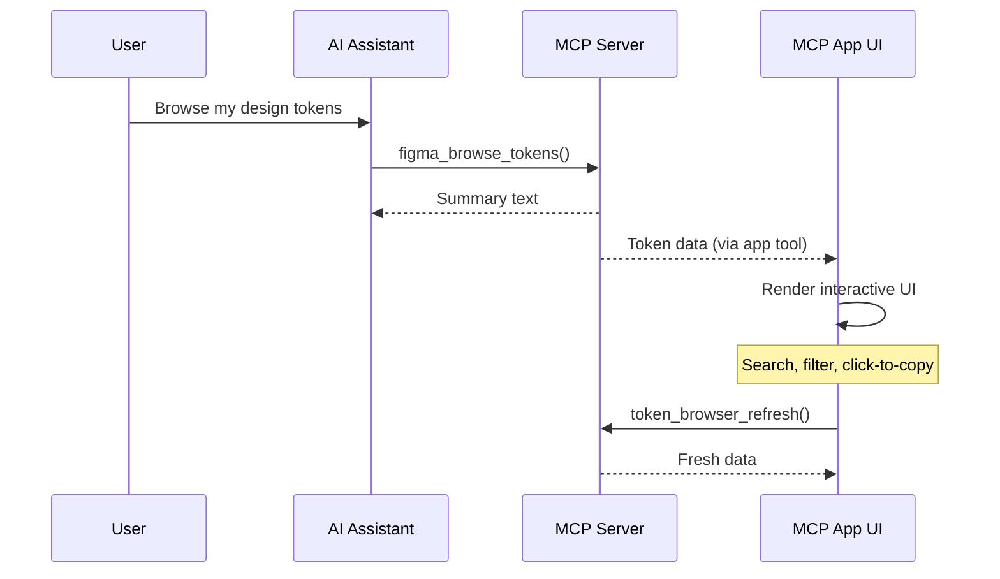

# MCP Apps

MCP Apps are rich, interactive UI panels that render directly inside your AI assistant. Instead of receiving plain text responses, you get fully interactive applications — with search, filtering, click-to-copy, and real-time data refresh.

<Note>
**Experimental** — MCP Apps use the [ext-apps protocol extension](https://github.com/anthropics/anthropic-cookbook/tree/main/misc/model_context_protocol/ext-apps) and require an MCP client with ext-apps support. The protocol may evolve.
</Note>

---

## How MCP Apps Work

MCP Apps extend the Model Context Protocol with a UI layer. When an AI tool returns a result, it can also include an interactive HTML application that renders inline in the conversation.



**Key concepts:**

- **Server-side tools** register with the MCP server and handle data fetching
- **App-only tools** are hidden from the AI model and callable only from the UI
- **Resource URIs** point the host to the HTML application to render
- **App SDK** (`@modelcontextprotocol/ext-apps`) handles the lifecycle, theming, and communication

---

## Available Apps

### Token Browser

Browse all design tokens from your Figma file in an interactive table.

**Features:**
- Organized by variable collection with expandable sections
- Filter by type (Colors, Numbers, Strings) and search by name
- Per-collection mode columns (Light, Dark, Custom) matching Figma's layout
- Color swatches with hex/rgba values and alias reference resolution
- Click any token name or value to copy it to your clipboard

**Usage:**

```
Browse the design tokens from https://figma.com/design/YOUR_FILE_ID
```

The AI calls `figma_browse_tokens` which returns a brief summary to the conversation and renders the full interactive Token Browser inline.

---

## Enabling MCP Apps

MCP Apps are gated behind an environment variable and only available in Local Mode.

```json
{
  "mcpServers": {
    "figma-console-local": {
      "command": "node",
      "args": ["/path/to/figma-console-mcp/dist/local.js"],
      "env": {
        "FIGMA_ACCESS_TOKEN": "figd_YOUR_TOKEN_HERE",
        "ENABLE_MCP_APPS": "true"
      }
    }
  }
}
```

When `ENABLE_MCP_APPS` is not set or set to `"false"`, no app tools are registered and existing functionality is completely unaffected.

---

## Architecture

Each MCP App follows a modular structure:

```
src/apps/<app-name>/
  server.ts              # Tool + resource registration (compiled by tsc)
  ui/
    mcp-app.html         # HTML shell with styles (bundled by Vite)
    mcp-app.ts           # App logic using ext-apps SDK (inlined into HTML)
```

**Build pipeline:**

1. **TypeScript** compiles `server.ts` to `dist/apps/<app-name>/server.js`
2. **Vite** bundles the UI into a single self-contained `dist/apps/<app-name>/mcp-app.html`
3. The server registers a resource URI that serves the built HTML file
4. The host renders the HTML inline when the tool is called

Apps use the official [`@modelcontextprotocol/ext-apps`](https://www.npmjs.com/package/@modelcontextprotocol/ext-apps) SDK for lifecycle management, host theming, and server communication.

---

## Building Apps

The build system supports multiple apps via the `APP_NAME` environment variable:

```bash
# Build a specific app
cross-env APP_NAME=token-browser vite build

# Build all apps (runs as part of npm run build)
npm run build:apps
```

Adding a new app requires:

1. Create `src/apps/<name>/server.ts` with tool and resource registration
2. Create `src/apps/<name>/ui/mcp-app.html` and `mcp-app.ts`
3. Add a `cross-env APP_NAME=<name> vite build` entry to the `build:apps` script
4. Register the app in `src/local.ts` inside the `ENABLE_MCP_APPS` gate

---

## Roadmap

The Token Browser is the first of several planned MCP Apps:

- **Component Gallery** — Visual browser for searching and previewing components with variant exploration
- **Style Inspector** — Interactive panel for exploring color, text, and effect styles with live previews
- **Variable Diff Viewer** — Side-by-side comparison of token values across modes and branches
- **Design System Dashboard** — Overview of your design system health with coverage metrics

---

## Learn More

- [MCP Apps Protocol Extension](https://github.com/anthropics/anthropic-cookbook/tree/main/misc/model_context_protocol/ext-apps) — Official specification
- [`@modelcontextprotocol/ext-apps` on npm](https://www.npmjs.com/package/@modelcontextprotocol/ext-apps) — Client and server SDK
- [Architecture](/architecture) — How Figma Console MCP works under the hood
