# Figma Desktop Bridge

<video src="https://github.com/user-attachments/assets/5fbb5099-476b-47e0-a61a-95d28299d0db" controls width="100%"></video>

A Figma plugin that connects your AI assistant directly to Figma, giving it live access to your variables, components, and design file while you work. No Enterprise plan required.

> **Part of [figma-console-mcp](../README.md)** - the full MCP server with 103 tools for design extraction, creation, and token sync. Installation, setup, architecture, and troubleshooting are covered there.

## Plugin UI

### v0.2.1 (current) - compact by default, show more when you need it

Stays out of the way until you need a closer look. Tap + to expand the sub-toolbar and switch between Info and Log panels to see what's happening under the hood.

The log panel has been redesigned from the ground up. Every entry shows a human-readable label derived from a leading comment in the code, so the log tells the story of what the AI did rather than listing raw API calls. Errors turn red and are prefixed with `[!]`, unrecognised code blocks show a `<Code>` prefix, and duplicate consecutive calls collapse to a single line with a repeat count. The full session log exports as clean plain text with timestamps - errors flagged, everything else undecorated.

<table>
<tr>
<td valign="top"><strong>Ready</strong> 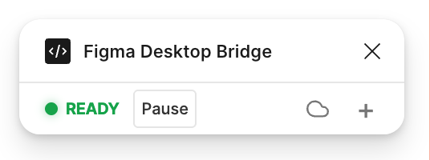</td>
<td valign="top"><strong>Disconnected</strong> 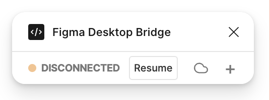</td>
<td valign="top"><strong>Sub-toolbar</strong> 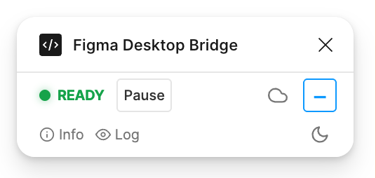</td>
<td valign="top"><strong>Cloud pairing</strong> 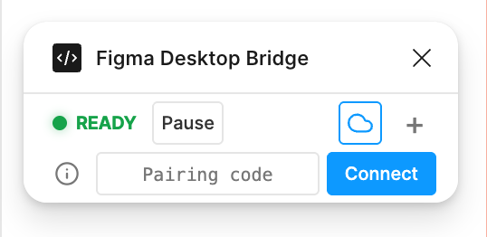</td>
</tr>
</table>

<table>
<tr>
<td valign="top"><strong>Info panel (masked)</strong> 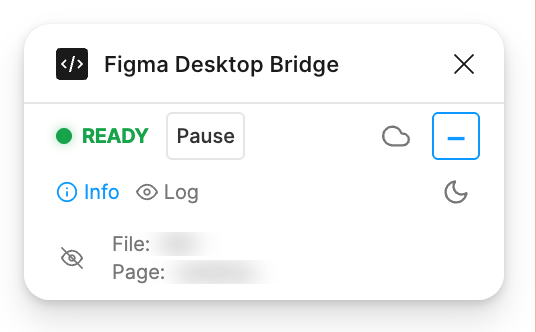</td>
<td valign="top"><strong>Info panel (visible)</strong> 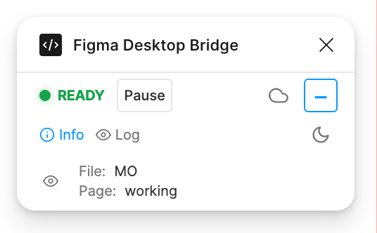</td>
<td valign="top"><strong>Cloud pairing help</strong> 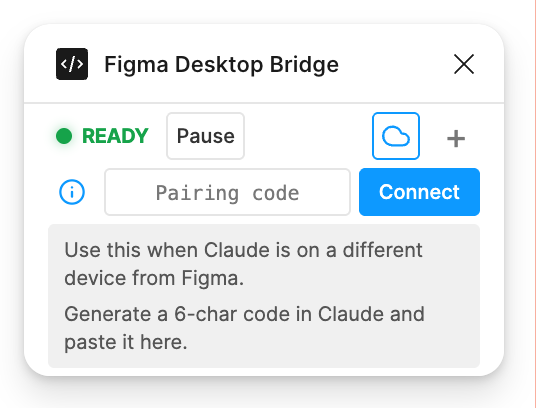</td>
</tr>
</table>

<table>
<tr>
<td valign="top"><strong>Log panel</strong> 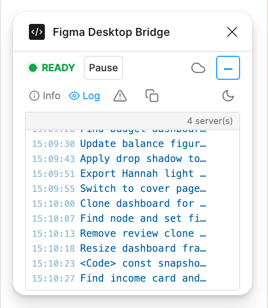</td>
<td valign="top"><strong>Errors filter</strong> 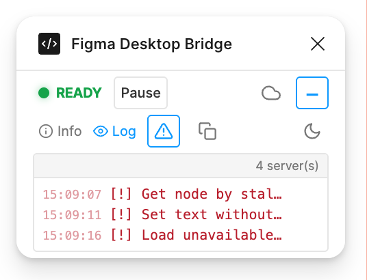</td>
<td valign="top"><strong>Copy to clipboard</strong> 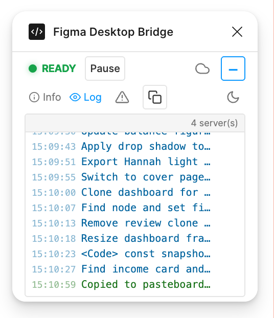</td>
</tr>
</table>

**Session log exported to text**

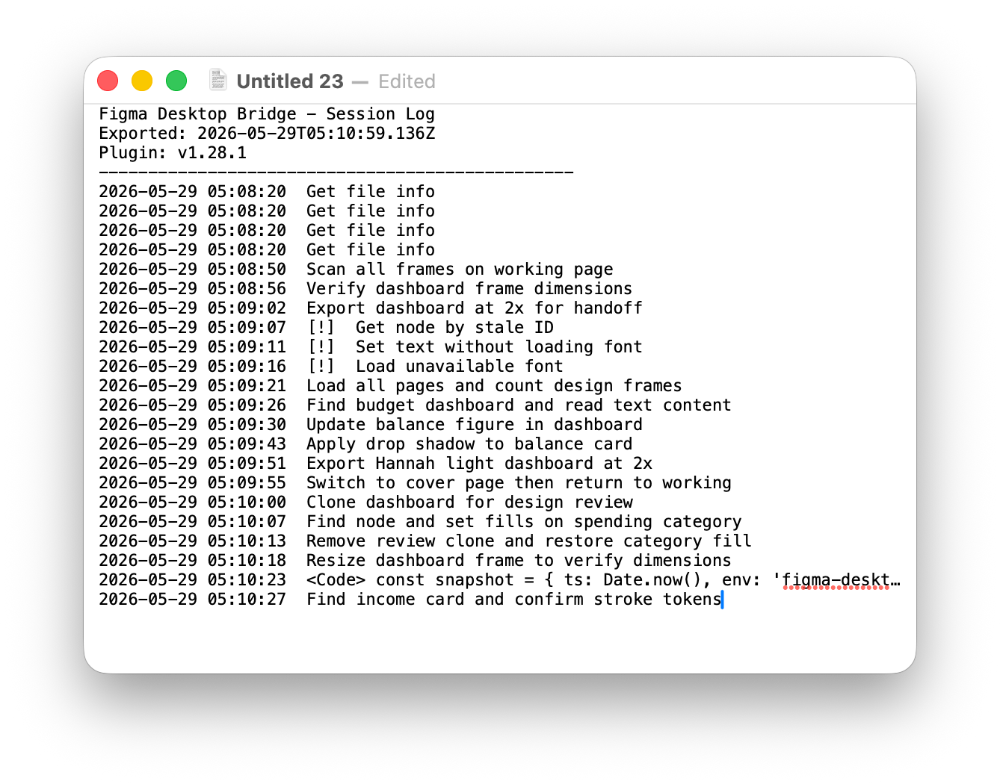

---

### v0.2.0 - light and dark mode, text toolbar, full log panel

Introduced light and dark mode, named toolbar actions (Info, Hide log, Errors, Copy log), and the full log panel with version label and multi-server count.

<table>
<tr>
<td valign="top"><strong>Connected</strong> 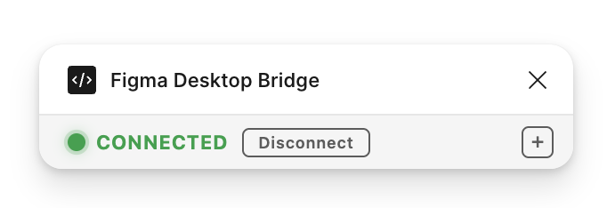</td>
<td valign="top"><strong>Sub-toolbar</strong> 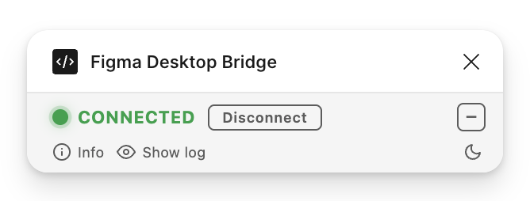</td>
<td valign="top"><strong>Info panel (masked)</strong> 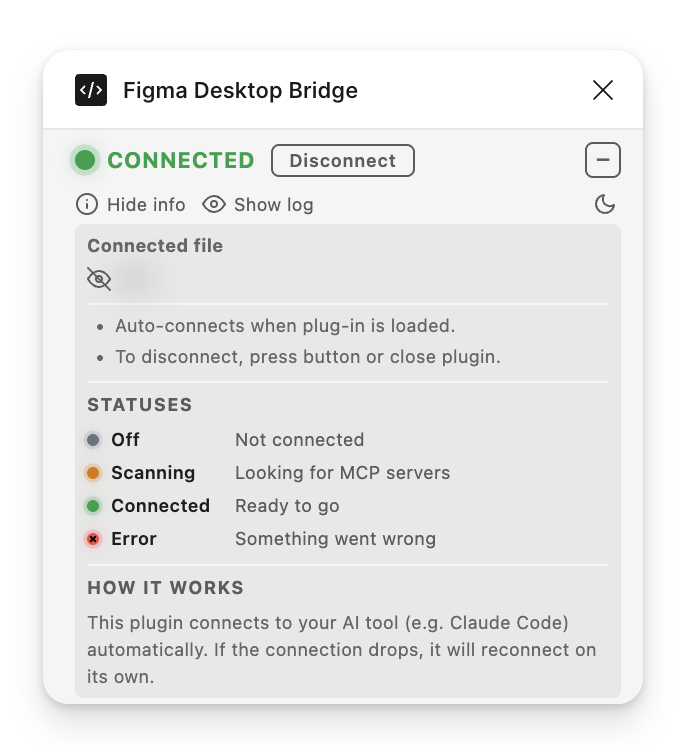</td>
<td valign="top"><strong>Info panel (visible)</strong> 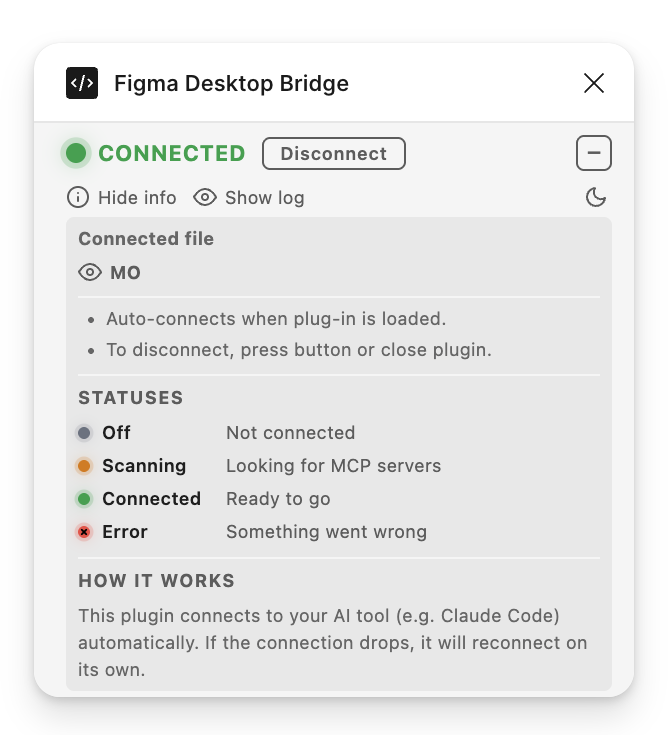</td>
</tr>
</table>

<table>
<tr>
<td valign="top"><strong>Log panel</strong> 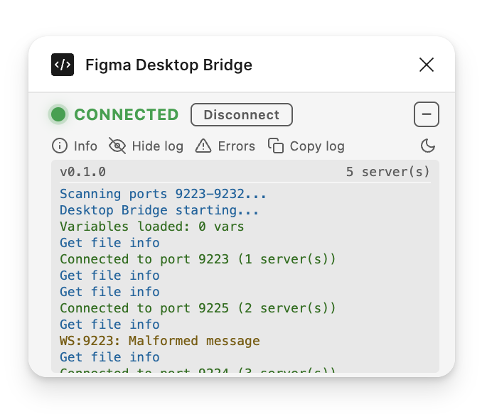</td>
<td valign="top"><strong>Errors filter</strong> 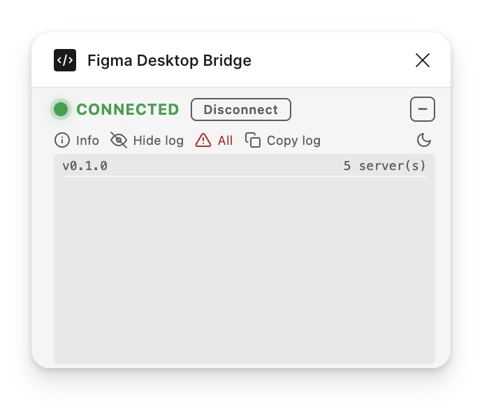</td>
<td valign="top"><strong>Audit log exported</strong> 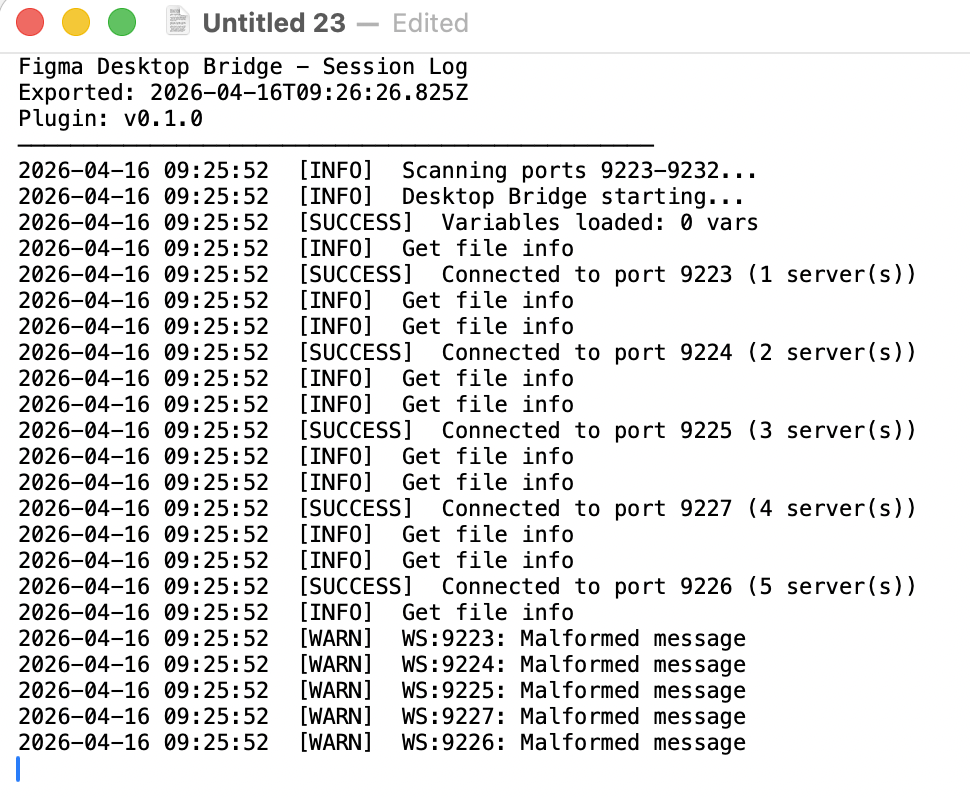</td>
</tr>
</table>

---

### v0.1.0 - initial release

First version: full-width info panel with connection status guide (Off / Scanning / Connected / Error), light/dark toggle, and live log output.

<table>
<tr>
<td valign="top"><strong>Connected</strong> </td>
<td valign="top"><strong>Info panel</strong> 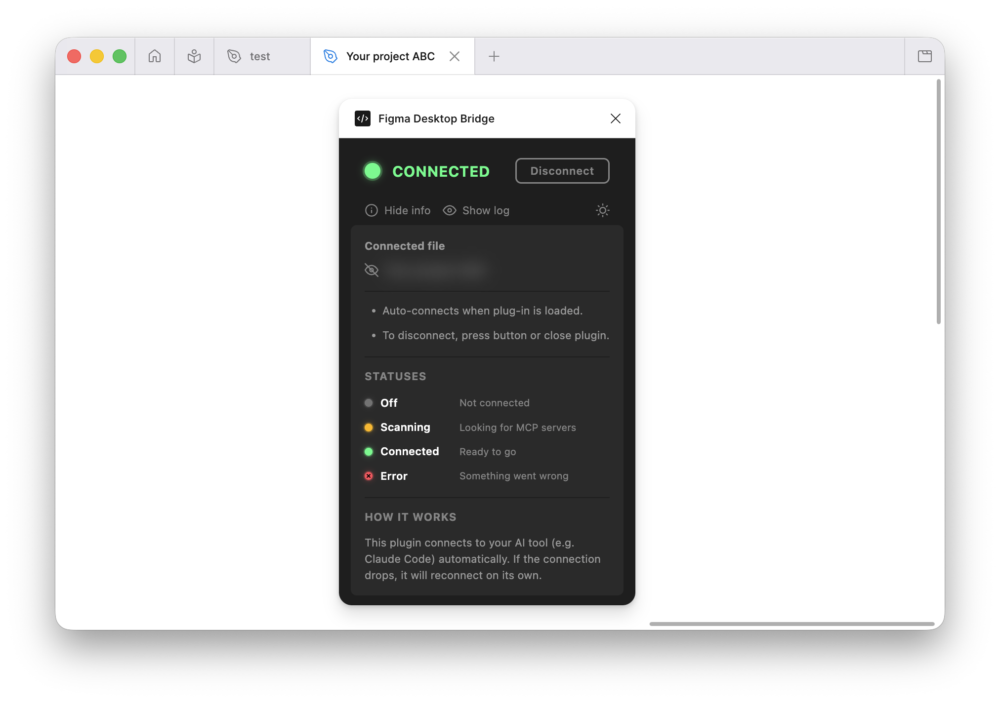</td>
<td valign="top"><strong>Info panel (masked)</strong> 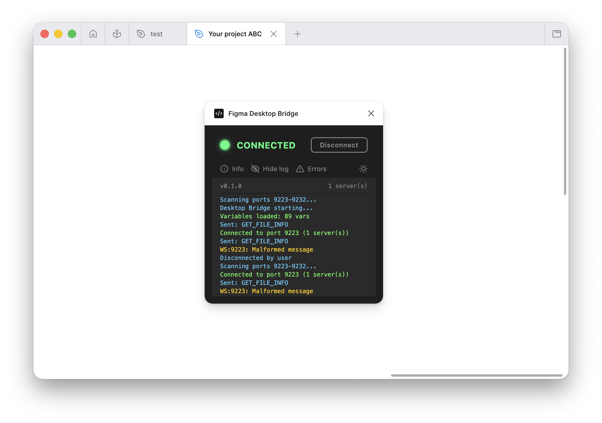</td>
<td valign="top"><strong>Log panel</strong> 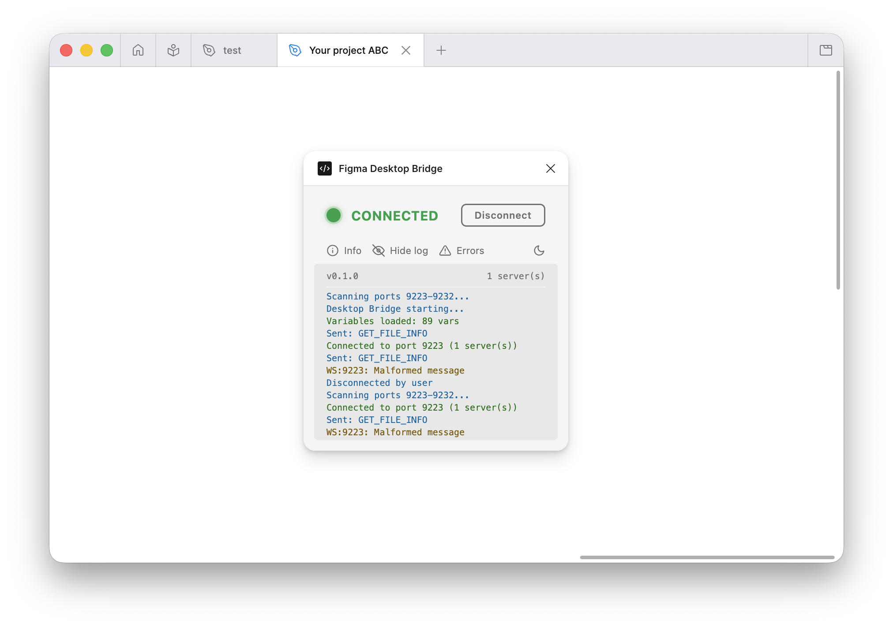</td>
</tr>
</table>
